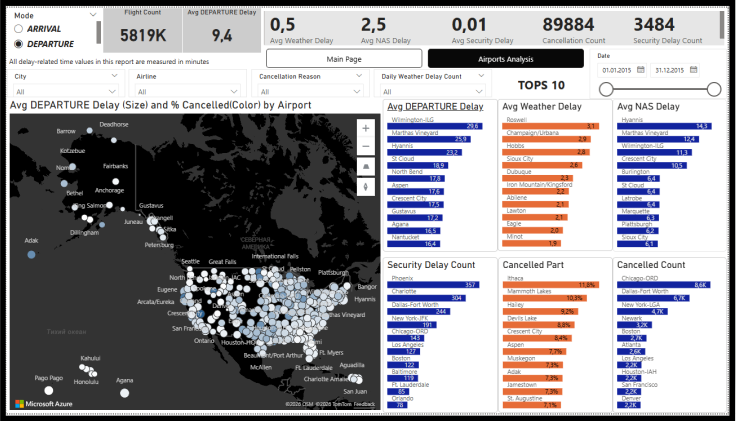
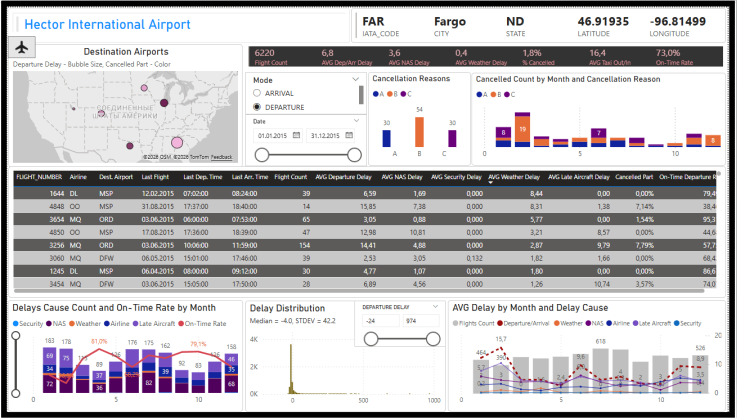
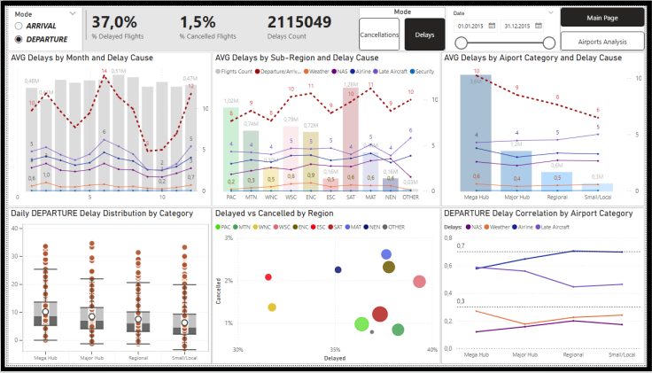
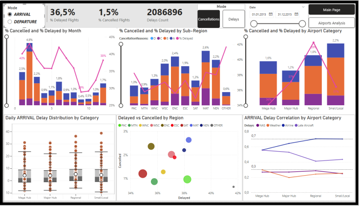

# 2015_US_Airports-PowerBI_project 🚀

## 📌 Project Overview
This project provides a comprehensive analysis of the **2015 US Flight Delays and Cancellations** dataset. Using Power BI, I developed an interactive multi-page dashboard to explore performance metrics across 5.8 million flights. The report provides both a high-level overview of all US airports and detailed airport-level analysis, with separate Departure and Arrival perspectives. It also explores how delays and cancellations depend on different factors and segments.

## 🎯 Key Objectives
*   **Identify Trends:** Analyze seasonal and monthly patterns in flight delays and cancellations.
*   **Root Cause Analysis:** Categorize delays and cancellatios by Weather, NAS (National Airspace System), Security, and Airline factors.
*   **Geospatial Insights:** Visualize flight performance across the United States using interactive maps.
*   **Comparative Analysis:** Compare performance between "Mega Hubs," "Major Hubs," "Regional," and "Small" airports.
*   **Statistical Distribution:** Use box plots and correlation charts to understand the variance and relationship between different delay types.

## 🛢️ Data Source
*   **Dataset:** [2015 Flight Delays and Cancellations](https://www.kaggle.com/datasets/usdot/flight-delays) from Kaggle (provided by the U.S. Department of Transportation).
*   **Scale:** Over 5.8 million records covering departures and arrivals for the entire year of 2015.

## 🛠 Tech Stack
*   **Tool:** Power BI Desktop
*   **Data Processing:** Power Query (ETL, data cleaning, and transformation)
*   **Modeling:** DAX (Data Analysis Expressions) for complex measures such as *Moving Averages, Dynamic Tooltips, and Category-based Correlations*.
*   **Visualization:** Geospatial maps, Box-and-Whisker plots, Bubble charts, and Time-series line charts.

## 📊 Gallery

1. Main Page

2. Selected Airport

3. Airport Analysis by Delays

4. Airport Analysis by Cancellations

 

👉[Watch report video review](https://drive.google.com/file/d/1RxhG_Ym4iGBYK-Q6sVSc-CF2hckTfH1K/view?usp=sharing)

## 🚀 Main Features & Interactivity
1.  **Dynamic Mode Switching:** A single toggle allows users to switch the entire report between **Arrival** and **Departure** metrics.
2.  **Airports Analysis (Drill-through):** Deep-dive into specific airports (e.g., Nantucket Memorial Airport) to see localized on-time rates, cancellation reasons, and monthly trends.
3.  **Statistical Insights:**
    *   **Box Plots:** Show the distribution of delays by airport category to identify outliers.
    *   **Correlation Matrix:** Analyzes how different delay causes (Weather vs. Airline vs. NAS) correlate with airport size.
4.  **Advanced Filtering:** Filter by Date range, Airline, City, and specific Cancellation Reasons (A, B, C, D).
5.  **Tops 10 Dashboard:** Quick-view cards showing the most problematic airports by average delay and total cancellation count.

## 💡 Key Insights
*   **Season Trends:** Delay duration shows clear seasonality, peaking in winter and summer months.
*   **Performance by Region:** By region, the share of delayed flights ranges from 30% to 40%, while cancellations account for 1%–3%. There is a slight increase in delays from west to east across the US.
*   **Hub Performance:** Average Departure Delay decreases consistently from large hubs to smaller airports, even though 9 out of the Top-10 airports by delay are Regional or Local. Average Arrival Delay, on the contrary, is slightly higher at smaller airports. The share of cancelled flights, both Departure and Arrival, is higher at smaller airports.
*    **Correlations:** Strong correlations (0.6–0.8) exist between Departure/Arrival delays and Airline Delay (stronger at smaller airports), and moderate correlations (0.4–0.6) with Late Aircraft Delay (more pronounced at large hubs).

## 📁 Repository Structure
*   `2015 US Airports.pdf` — Static export of the dashboard pages.
*   `2015 US Airports.mp4` — A screen recording demonstrating the interactivity and navigation of the Power BI report.
  

---
**Author:** Viacheslav Pomazan  
**Role:** Data Analyst  
**Links:** [LinkedIn](https://www.linkedin.com/in/viacheslav-pomazan) | [GitHub](https://github.com/ViacheslavPomazan)

